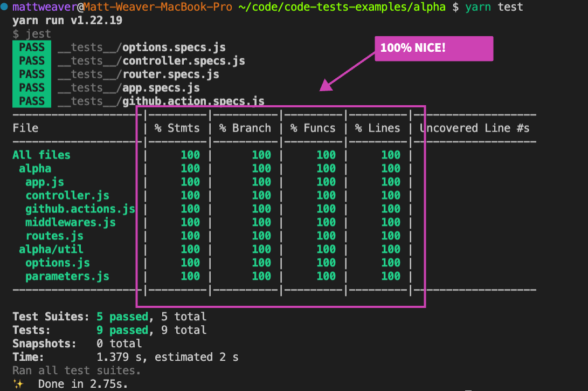
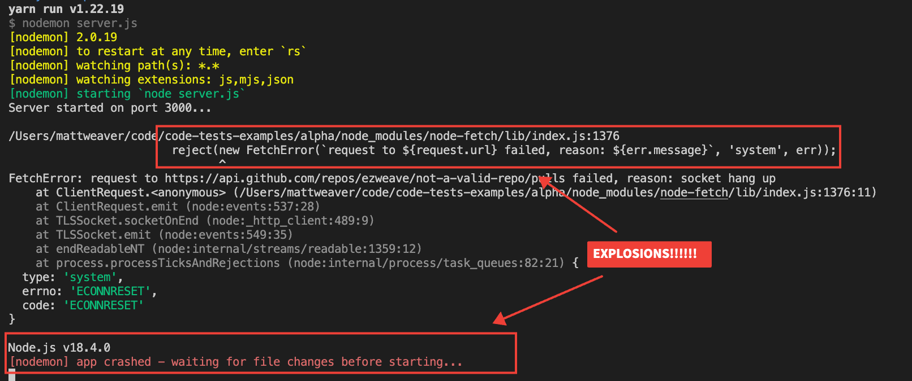
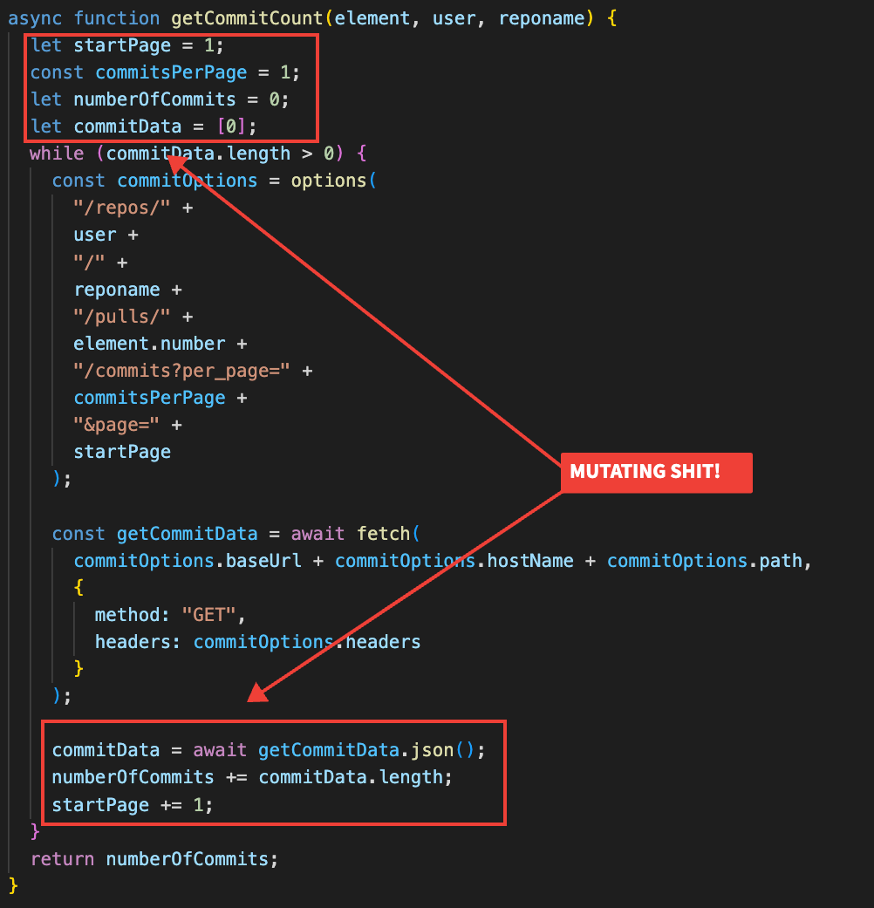

# Code Test Example

This is a project that was submitted as a code test by a candidate who was not hired, based on this test. We've stripped out identifying information, and tossed in some notes.

To make it easy on your author, we'll call the candidate, [Bort Sampson](https://simpsons.fandom.com/wiki/Bort_Sampson).


For context, Bort was applying for the position of "Senior Software Person Job Thingy". Bort has a Bachelor's of Science in Computer Science from [Springfield University](https://simpsons.fandom.com/wiki/Springfield_University) and ten years of experience, with eight of those years specifically in `Node.js` and another five using `AWS` and `Lambda`.

## Table of Contents

- [The Acceptance Criteria](#the-acceptance-criteria)
- [Running The Code]()
- [The Good (Positives!)](#the-good)
- [The Bad (Deal Breakers For Your Author)](#the-bad)
- [The Ugly (Debatable Aspects)](#the-ugly)

## The Acceptance Criteria

Here is the problem statement that Bort was given:

### Problem statment

Using the GitHub API <https://developer.github.com/v3>, we ask that you build an API that:

- Uses NodeJs
- Exposes an endpoint that returns the following information for a GitHub Repository URL provided by the user:
- The id, number, title, author, and number of commits of each open pull requests. (Do not use to return this metadata. Instead, make multiple requests via the REST api in order to fetch the data necessary.)
- For each open PR, return the following information:
  - ID
  - Number
  - Title
  - Author
  - The number of commits
- The response from your API should look something like this:

```json
[
  {
    "id": 1,
    "number": 100,
    "title": "Tile of Pull Request 1",
    "author": "Author of Pull Request 1",
    "commit_count": 8
  },
  {
    "id": 2,
    "number": 101,
    "title": "Tile of Pull Request 2",
    "author": "Author of Pull Request 2",
    "commit_count": 4
  },
  {
    "id": 3,
    "number": 102,
    "title": "Tile of Pull Request 3",
    "author": "Author of Pull Request 3",
    "commit_count": 12
  }
]
```

- Implements a testing strategy (unit tests, integration tests, something else?).
- Incorporates simple, clean code architecture.
- Treat this like a real API intended for public consumption, barring resources and performance.

Take your time to build your solution. We don’t want you to feel rushed balancing the interview process with your day-to-day life. Give us your best, not the fastest/easiest.

[Back](#table-of-contents)

## Running the Code

The author has removed the original `README.md`, but to run the code:

```shell
cd bort-sampson
yarn
yarn start
```

Tests are run via:

```shell
yarn test
```

[Back](#table-of-contents)

## The Good

Let's talk about the things that Bort did pretty well.

First off, Bort has written a number of tests. Testing is always a good thing.



Not only that, but Bort is covering _all_ statements, branches, etc. Way to go Bort! Though Bort did seem to miss one thing... more on that later!

Secondly, the design is sensible and meets the Acceptance Criteria (AC).

For cases like this, it works:

```shell
curl -GET http://localhost:3000/github_api/pulls/ezweave/what-name-branch
```

It returns an empty array (a personal project of the author for which he does not have any open pull requests), which is correct (in this case).

[Back](#table-of-contents)

## The Bad

If you want to look at some of the more debatable items, jump to ["The Ugly"](#the-ugly). Your author just wanted to make a pop-culture reference, hence the order of these sections.

The biggest problem, in your author's opinion, is that it has a pretty bad bug. Bort, who was applying for a Senior role, should probably have written some error handling!

The following `curl` request would kill the Node process running Express:

```
curl -GET http://localhost:3000/github_api/pulls/ezweave/not-a-valid-repo
```

This could be do to a lack of error handling in both tests and validation:



And it doesn't just error out... it really does kill the Express process. Further requests result in:

```shell
curl: (7) Failed to connect to localhost port 3000 after 6 ms: Connection refused
```

Again, if this is a _Senior_ (as Bort was), this is pretty ~~bad~~ ugly. Probably one of the first things one would test.

Furthermore, there is not a single `catch` or `reject` in any of the code. That ain't "very senior", Bort!

[Back](#table-of-contents)

## The Ugly

This is stuff that is _debatable_. Some of it is merely subjective, some of it is perhaps things that "could be better" which may alter one's opinion on the repo. None of this is part of the AC, just things that would change you or the author's evaluation of Bort's work.

### Generally Ugly Shit

This is stuff that the author would posit is just _generally_ undesireable in a test from someone of Bort's ostensible pedigree:

- **No unit tests.** While Bort has good test coverage, his tests are all _integration_ tests. Had Bort actually written unit tests, Bort may have avoided ["The Bad"](#the-bad). The AC also explicitly stated:
  > Implements a testing strategy (unit tests, integration tests, something else?).
- **Trivial tests.** Some of the tests that were written are pretty trivial, added only for coverage. This is sort of a side-effect of basing the project on Express, so this is kind of a "meh". The author argues it would have been nice to avoid things like testing the [routing](./bort-sampson/__tests__/router.specs.js), etc.
- **No .gitignore file.** Yeah, so Bort checked in all kinds of garbage. `node_modules`, Jest coverage, etc. Bort _should_ know better.

### Super Subjective Shit

Your author is fairly biased towards more _functional_ JavaScript (E.g. "Functional Programming" or "FP"), so take this all with a big ol' grain of sodium chloride. Most of these are things the author would have given Bort bonus points for, perhaps offsetting ["The Bad"](#the-bad).

**THIS IS THE SUPER SUBJECTIVE STUFF**

The author is not sure you heard him, so again:

<span style="font-size:larger;color:red">THIS IS THE SUPER SUBJECTIVE STUFF, THE BONUS CONTENT, THE 100% COMPLETION AWARD, ET CETERA ET CETERA! BELOW THIS LINE ARE THINGS THE AUTHOR LIKES TO SEE, BUT ABSOLUTELY WILL NOT PASS ON A CANDIDATE WHO DOES NOT FOLLOW THEM!</span>

Anyway, dear reader, please bear that in mind! More to the point:

- **Mutating code.** There's a ton of mutation going on. If Bort's been writing `Node.js` as long as they say they have, that's a pretty _bad smell_.
  
- **Use of Express.** In 2022, someone familiar with AWS should probably be using `serverless` unless they have a damn good reason not to. Express was fine, but it has to run in EC2 or ECS and costs more to run and comes with a bit of boilerplate that has to be maintained (routes, etc). Not a deal breaker, but not something that enamors the author to old Bort.
- **Brittle function calls.** _This is extremely subjective!!!!_ The author favors either careful guarding with the existential operator (`?`) or using the wildly popular `lodash` library for operations like `map`, etc. `lodash` lends to better FP style composition, but it also won't break on a call like `array.map` if `array` is `undefined`. The existential operator works too, assuming Bort knows how to update his build targets to... oh, what's that you say?
- **It might not run on your box.** Since Bort neglected to use any sort of build tool, this repo relies on _your_ installed version of `Node.js`. Bort didn't include a `.npx` file or anything else to enforce how this would run. Fine for anyone _but_ a senior. Bort also didn't bother to put his source under either a `lib` or `src` directory.
- **A "tests" folder**. _Again, another extremely objective opinion!_ You may notice that some projects (or maybe all of the projects you're looking at), have a separate folder for unit and integration tests. Your author is a devotee of FP and TDD (Test Drive Development) and prefers to have tests next to source. This does require the use of `webpack` or some other build tool to strip tests from a distribution, but it just makes it easier to both _grok_ and work on code. E.g. `src/util/foo.ts` has a `src/util/foo.test.ts` next to it, versus `__tests__/util/foo.test.ts`. Again, not the end of the world. Super subjective. But Bort missed some easy points here.
- **Pretty non-FP code.** You're in the author's subjective section, so it probably won't surprise you, dear reader, that the author wishes Bort had done things in a more "FP way".
- **A while loop.** [Really, Bort?](./bort-sampson/github.actions.js#50) In 2022? ~~At this latitude?~~

[Back](#table-of-contents)
